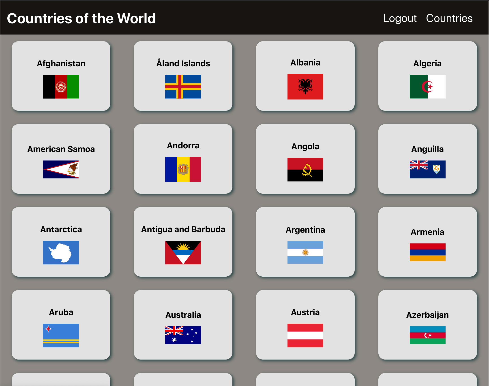

## Introduction

Countries of the World is an app that shows you some info on a country of your choice.

### Screenshots of app:

Main page

Index page

## Technologies Used

- React.js
- JavaScript
- CSS3
- Node.js
- Mongoose
- MongoDB
- Authentication w/ JWT
- GitHub
- Heroku
- Netlify

## Getting Started

Trello planning:
https://trello.com/b/d81C5IuK/countries

Link to site:
https://project3-countries.netlify.app/

## Unsolved Problems

- Give app more transitional functionality

## Future Enhancements

- Allow users to show that they have visited a country
- Allow users to show that a country is on their bucket list to visit
- Allow users to search for countries by name, region, language spoken
